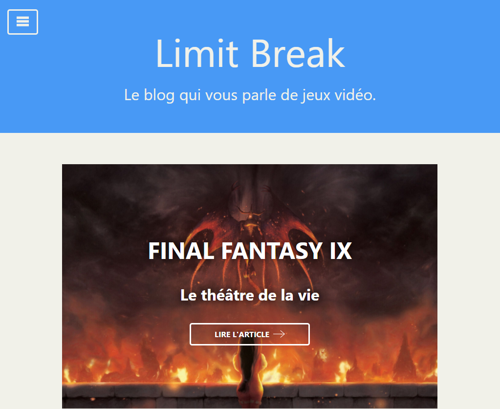

# Limit Break

## Un projet de Blog 👋

Afin de me lancer un __nouveau challenge__, j'ai décidé de créer un blog qui parle de jeux vidéo.

(Les articles du blog sont de faux articles rédigés en Lorem.)

## Contenu du blog

- __Accueil__ : la liste de tous les articles du blog avec un lien vers chaque article.
- __Article de blog__ :

    &#10149; les éléments constitutifs de l'article (intro, corps, conclu + auteur, date de publication).

    &#10149; un espace commentaire dédié à chaque article (lire les coms, ajouter un nouveau com).

- __Liste des jeux__ : une page sur laquelle on retrouve facilement l'ensemble des articles du blog par catégorie.

- __A propos__ : 

    &#10149; un espace qui met en avant le parcours de l'auteur et la direction de son site.

    &#10149; un formulaire de contact à l'adresse de l'auteur.

- __404__ : la page qui s'affiche lorsque l'utilisateur rentre une adresse non existante (un bouton de retour vers l'accueil est mis à disposition).

- Le blog est aussi constitué d'un __menu__ afin de fluidifié la navigation sur le site.

## Les outils de création

### Coté Front

Le blog est une single page application crée avec __React__.

__Redux__ est utilisé en supplément afin de gérer les intéractions coté client et serveur dans un state global.

__Axios__ permet de consommer les données coté serveur.

__CSSTransitionGroup__ est utilisé pour animer l'ouverture et la fermeture de la barre de navigation.

### Coté Back

L'ensemble des données sont gérés par __Strapi__ (un headless CMS open source crée en JS).

Strapi utilise une BDD __PostgreSQL__.

Les images sont stockées sur __Cloudinary.com__.

## Le Deploiement

### Coté Front

Le blog est deployé via la plateforme gratuite [vercel.com](https://vercel.com) à l'adresse suivante [https://limitbreak.vercel.app/](https://limitbreak.vercel.app/).

Une fois liée à notre compte GitHub, Vercel est une plateforme en ligne qui s'occupe de déployer automatiquement la branche master d'un projet à chaque fois qu'elle est mise à jour.

### Coté Back

Strapi à été déployé sur [heroku.com](https://heroku.com) qui est une plateforme gratuite.

Les données sont donc stockées dans BDD Heroku Postgres, en revanche les images ne sont pas conservées sur cette BDD.

Elles sont donc stockées sur [cloudinary.com](https://cloudinary.com).
