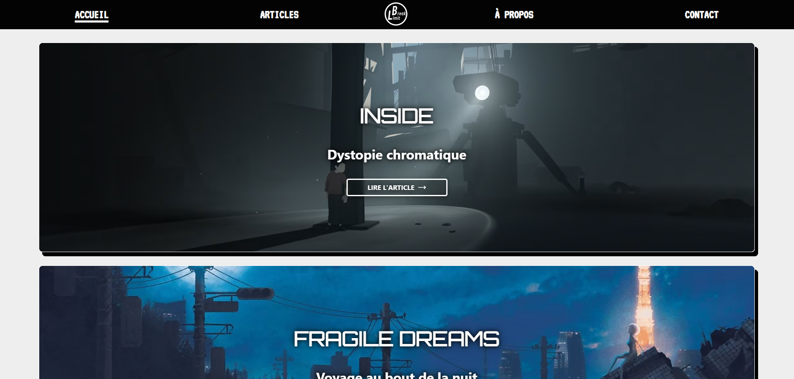

# Limit Break

## Un projet de Blog 👋

Afin de me lancer un __nouveau challenge__, j'ai décidé de créer un blog qui parle de jeux vidéo.

## Contenu du blog

🏠 __Accueil__ : la liste de tous les articles du blog avec un lien vers chaque article.

🎮 __Article de blog__ :

- les éléments constitutifs de l'article (intro, corps, conclu + auteur, date de publication).

- un espace commentaire dédié à chaque article (lire les coms, ajouter un nouveau com).

- une suggestion d'articles similaires pour prolonger la lecture (thèmes identiques en priorité).

📋 __Liste des jeux__ : une page sur laquelle on retrouve facilement l'ensemble des articles du blog par catégorie.

👤 __A propos__ : un espace qui met en avant le parcours de l'auteur et la direction de son site.

✉️ __Contact__ : un formulaire de contact à l'adresse de l'auteur.

🚫 __404__ : la page qui s'affiche lorsque l'utilisateur rentre une adresse non existante (un bouton de retour vers l'accueil est mis à disposition).

## Les outils de création 🛠️

### 💻 Front-end

Le blog est une __single page application__ (SPA) construite avec __React__ et bundlée via __Vite.js__.

- __React Router__ gère la navigation côté client (accueil, articles, jeux, à propos, contact, 404).
- __Redux__ centralise l'état global de l'application (articles, commentaires, thèmes, interactions UI).
- __Axios__ consomme les API serverless pour récupérer et envoyer les données.
- __Sass__ assure le styling des composants.
- __React Quill__ permet l'édition de contenu riche (articles / commentaires).
- __EmailJS__ envoie les messages du formulaire de contact sans backend dédié.

### ⚡ Back-end (serverless)

Il n'y a pas de serveur Node.js permanent : l'API repose sur des __Serverless Functions Vercel__ situées dans le dossier `api/`.

Chaque fichier de ce dossier devient un endpoint HTTP autonome, démarré à la demande puis arrêté une fois la requête traitée :

- `/api/posts` — lecture et écriture des articles
- `/api/comments` — lecture et écriture des commentaires
- `/api/themes` — lecture et écriture des thèmes / catégories

### 🗄️ Base de données

Les données sont stockées dans __MongoDB__, accessible via le driver officiel `mongodb`.

Collections principales :

- `posts` — articles du blog
- `comments` — commentaires liés aux articles
- `themes` — catégories / thèmes des articles

Les fonctions serverless se connectent à MongoDB à chaque invocation (avec réutilisation du client quand c'est possible) pour lire ou écrire ces collections.

## Le Déploiement 🚀

### ☁️ Coté Front & API

Le projet est déployé sur [vercel.com](https://vercel.com) à l'adresse [https://limitbreak.vercel.app/](https://limitbreak.vercel.app/).

Une fois lié au compte GitHub, Vercel redéploie automatiquement la branche `master` à chaque mise à jour : le build Vite du front et les fonctions serverless de `api/` sont publiés ensemble.
